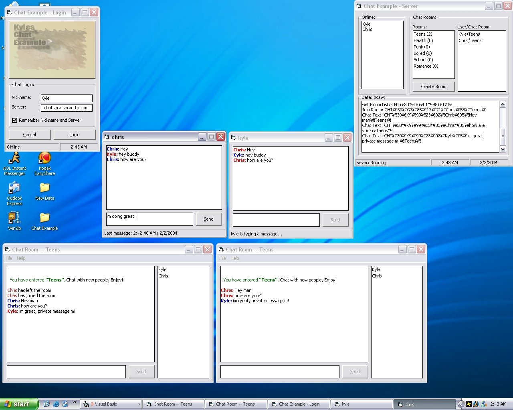



## Chatroom Example \(With Private Messaging, Multiple Chat Rooms\)

### Description

My reason for this coding was to show people how easy it was to create a chat client with multiple chat rooms, and allow the users to create there own rooms. Also showing how to do instant messaging, with fast and efficient coding, also clean.
 
### More Info
 

             |
---                |---
**Submitted On**   |2004-02-02 02:41:12
**By**             |[Kyle](https://github.com/Planet-Source-Code/PSCIndex/blob/master/ByAuthor/kyle.md)
**Level**          |Advanced
**User Rating**    |4.5 (36 globes from 8 users)
**Compatibility**  |VB 6\.0
**Category**       |[Internet/ HTML](https://github.com/Planet-Source-Code/PSCIndex/blob/master/ByCategory/internet-html__1-34.md)
**World**          |[Visual Basic](https://github.com/Planet-Source-Code/PSCIndex/blob/master/ByWorld/visual-basic.md)
**Archive File**   |[Chatroom\_E170279222004\.zip](https://github.com/Planet-Source-Code/kyle-chatroom-example-with-private-messaging-multiple-chat-rooms__1-51419/archive/master.zip)

